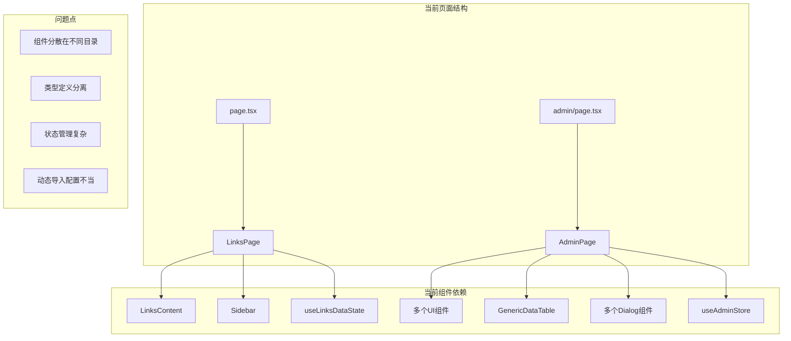
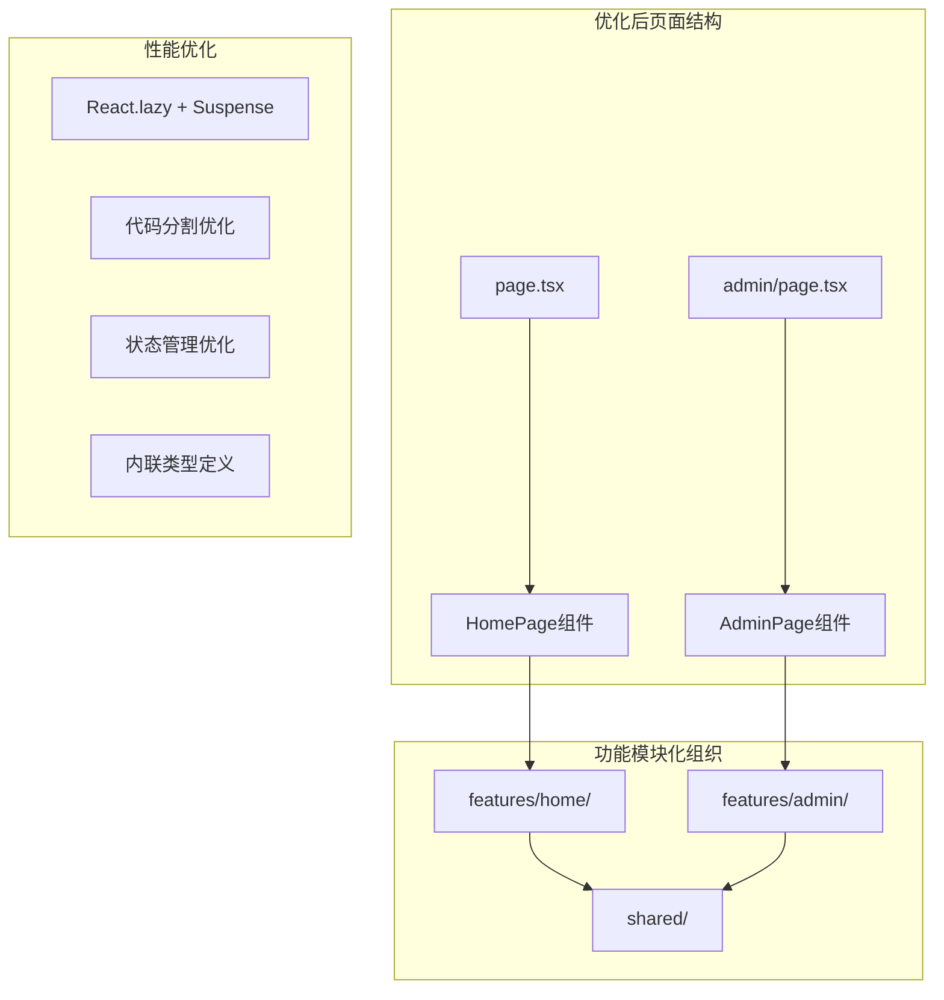
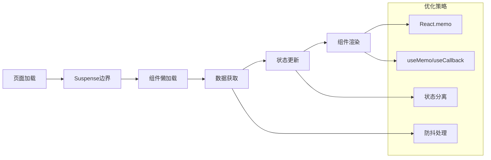

# Hub 应用页面优化设计文档

## 概述

本设计文档针对 Hub 应用的主页面（page.tsx）和管理页面（admin/page.tsx）进行优化重构。通过分析现有代码结构，我们发现当前的组件组织方式存在一些性能和维护性问题。本设计将采用功能导向的扁平化目录结构，内联类型定义，并优化组件加载策略，在保持功能和样式不变的前提下提升性能。

## 架构

### 当前架构分析



### 优化后架构设计



## 组件和接口

### 1. 目录结构重组

#### 新的扁平化目录结构
```
apps/hub/src/
├── app/
│   ├── page.tsx                    # 优化后的主页面
│   └── admin/
│       └── page.tsx                # 优化后的管理页面
├── components/
│   ├── home/                       # 主页功能模块（扁平化）
│   │   ├── home-page.tsx           # 主页面组件
│   │   ├── links-content.tsx       # 链接内容组件
│   │   ├── sidebar.tsx             # 侧边栏组件
│   │   ├── use-links-data.ts       # 链接数据hook
│   │   ├── use-categories.ts       # 分类数据hook
│   │   ├── types.ts                # 内联类型定义
│   │   └── index.ts                # 统一导出
│   ├── admin/                      # 管理功能模块（扁平化）
│   │   ├── admin-page.tsx          # 管理页面组件
│   │   ├── data-table.tsx          # 数据表格组件
│   │   ├── search-filter.tsx       # 搜索过滤组件
│   │   ├── page-header.tsx         # 页面标题组件
│   │   ├── admin-dialogs.tsx       # 对话框组件集合
│   │   ├── use-admin-data.ts       # 管理数据hook
│   │   ├── use-filtered-items.ts   # 过滤逻辑hook
│   │   ├── use-event-handlers.ts   # 事件处理hook
│   │   ├── admin-store.ts          # 管理状态store
│   │   ├── types.ts                # 内联类型定义
│   │   └── index.ts                # 统一导出
│   ├── shared/                     # 共享工具模块（扁平化）
│   │   ├── error-boundary.tsx      # 错误边界组件
│   │   ├── use-debounced-value.ts  # 防抖hook
│   │   ├── use-async-error.ts      # 异步错误处理hook
│   │   ├── performance.ts          # 性能工具
│   │   ├── types.ts                # 共享类型定义
│   │   └── index.ts                # 统一导出
│   └── [其他现有组件目录保持不变]
```

### 2. 页面组件优化

#### 优化后的主页面 (page.tsx)
```typescript
import type { Metadata } from "next";
import { Suspense } from "react";
import { HomePage } from "@/features/home";

export const metadata: Metadata = {
  title: "网址导航",
  description: "收集整理各类优质网站资源，方便快速访问",
  openGraph: {
    title: "网址导航",
    description: "收集整理各类优质网站资源，方便快速访问",
    type: "website",
  },
};

export default function Page() {
  return (
    <Suspense fallback={<div>加载中...</div>}>
      <HomePage />
    </Suspense>
  );
}
```

#### 优化后的管理页面 (admin/page.tsx)
```typescript
import { Suspense } from "react";
import { AdminPage } from "@/features/admin";

export default function Page() {
  return (
    <div className="min-h-screen bg-background w-full">
      <div className="container mx-auto px-4 py-4">
        <div className="mt-4">
          <Suspense fallback={<div>加载管理界面...</div>}>
            <AdminPage />
          </Suspense>
        </div>
      </div>
    </div>
  );
}
```

### 3. 功能模块设计

#### Home 功能模块

**类型定义 (components/home/types.ts)**
```typescript
// 内联类型定义，避免外部依赖
export interface LinksItem {
  id: string;
  title: string;
  url: string;
  description: string;
  icon: string;
  iconType: 'image' | 'text';
  category: string;
  tags: string[];
  featured: boolean;
}

export interface Category {
  id: string;
  name: string;
  children?: SubCategory[];
}

export interface SubCategory {
  id: string;
  name: string;
}

export interface HomePageProps {
  initialData?: LinksItem[];
}
```

**主页面组件 (components/home/home-page.tsx)**
```typescript
"use client";

import { memo } from "react";
import { LinksContent } from "./links-content";
import { Sidebar } from "./sidebar";
import { useLinksData } from "./use-links-data";
import type { HomePageProps } from "./types";

export const HomePage = memo(({ initialData }: HomePageProps) => {
  const { categories, selectedCategory, filteredItems, handleCategoryClick } = 
    useLinksData(initialData);

  return (
    <div className="min-h-screen bg-background">
      <div className="container mx-auto px-4">
        <div className="grid grid-cols-12 gap-6">
          <div className="col-span-12 md:col-span-2">
            <Sidebar
              categories={categories}
              selectedCategory={selectedCategory}
              onCategoryChange={handleCategoryClick}
            />
          </div>
          <div className="col-span-12 md:col-span-10 md:col-start-3">
            <LinksContent 
              items={filteredItems} 
              selectedCategory={selectedCategory} 
            />
          </div>
        </div>
      </div>
    </div>
  );
});

HomePage.displayName = "HomePage";
```

#### Admin 功能模块

**类型定义 (components/admin/types.ts)**
```typescript
// 内联管理页面相关类型
export interface AdminPageState {
  items: LinksItem[];
  searchTerm: string;
  selectedCategory: string;
  showAddDialog: boolean;
  editingItem: LinksItem | null;
  deletingItem: LinksItem | null;
  loading: boolean;
  error: string | null;
}

export interface DataTableColumn<T> {
  key: keyof T;
  title: string;
  width?: string;
  render?: (value: unknown, record: T, index: number) => React.ReactNode;
}

export interface DataTableAction<T> {
  label: string;
  onClick: (record: T) => void;
  icon: React.ComponentType;
  variant: 'default' | 'outline' | 'destructive';
}

export interface SearchFilterProps {
  searchTerm: string;
  onSearchChange: (term: string) => void;
  selectedCategory: string;
  onCategoryChange: (category: string) => void;
  categories: Category[];
}
```

**管理页面组件 (components/admin/admin-page.tsx)**
```typescript
"use client";

import { memo } from "react";
import { DataTable } from "./data-table";
import { SearchFilter } from "./search-filter";
import { PageHeader } from "./page-header";
import { AdminDialogs } from "./admin-dialogs";
import { useAdminData } from "./use-admin-data";
import { useFilteredItems } from "./use-filtered-items";
import { useEventHandlers } from "./use-event-handlers";
import type { AdminPageProps } from "./types";

export const AdminPage = memo(({ initialData }: AdminPageProps) => {
  const {
    items,
    searchTerm,
    selectedCategory,
    showAddDialog,
    editingItem,
    deletingItem,
    categories,
    setSearchTerm,
    setSelectedCategory,
    setShowAddDialog,
    setEditingItem,
    setDeletingItem,
    loadData
  } = useAdminData(initialData);

  const filteredItems = useFilteredItems(items, searchTerm, selectedCategory);
  
  const eventHandlers = useEventHandlers({
    loadData,
    setShowAddDialog,
    setEditingItem,
    setDeletingItem
  });

  return (
    <>
      <PageHeader itemCount={items.length} />
      
      <SearchFilter
        searchTerm={searchTerm}
        onSearchChange={setSearchTerm}
        selectedCategory={selectedCategory}
        onCategoryChange={setSelectedCategory}
        categories={categories}
      />

      <DataTable
        data={filteredItems}
        onEdit={setEditingItem}
        onDelete={setDeletingItem}
      />

      <AdminDialogs
        showAddDialog={showAddDialog}
        editingItem={editingItem}
        deletingItem={deletingItem}
        onAddDialogChange={setShowAddDialog}
        onEditDialogChange={(open) => !open && setEditingItem(null)}
        onDeleteDialogChange={(open) => !open && setDeletingItem(null)}
        eventHandlers={eventHandlers}
      />
    </>
  );
});

AdminPage.displayName = "AdminPage";
```

## 数据模型

### 状态管理优化

#### 简化的状态管理模型
```typescript
// components/admin/admin-store.ts
import { create } from 'zustand';
import { subscribeWithSelector } from 'zustand/middleware';
import type { AdminPageState, LinksItem } from '../types';

interface AdminStore extends AdminPageState {
  // Actions
  setItems: (items: LinksItem[]) => void;
  setSearchTerm: (term: string) => void;
  setSelectedCategory: (category: string) => void;
  setShowAddDialog: (show: boolean) => void;
  setEditingItem: (item: LinksItem | null) => void;
  setDeletingItem: (item: LinksItem | null) => void;
  setLoading: (loading: boolean) => void;
  setError: (error: string | null) => void;
  reset: () => void;
}

const initialState: AdminPageState = {
  items: [],
  searchTerm: '',
  selectedCategory: '',
  showAddDialog: false,
  editingItem: null,
  deletingItem: null,
  loading: false,
  error: null,
};

export const useAdminStore = create<AdminStore>()(
  subscribeWithSelector((set) => ({
    ...initialState,
    
    setItems: (items) => set({ items }),
    setSearchTerm: (searchTerm) => set({ searchTerm }),
    setSelectedCategory: (selectedCategory) => set({ selectedCategory }),
    setShowAddDialog: (showAddDialog) => set({ showAddDialog }),
    setEditingItem: (editingItem) => set({ editingItem }),
    setDeletingItem: (deletingItem) => set({ deletingItem }),
    setLoading: (loading) => set({ loading }),
    setError: (error) => set({ error }),
    reset: () => set(initialState),
  }))
);
```

### 数据流优化

#### 性能优化的数据流设计


## 错误处理

### 1. 组件级错误边界
```typescript
// components/shared/error-boundary.tsx
import { Component, type ReactNode } from 'react';

interface Props {
  children: ReactNode;
  fallback?: ReactNode;
}

interface State {
  hasError: boolean;
  error?: Error;
}

export class FeatureErrorBoundary extends Component<Props, State> {
  constructor(props: Props) {
    super(props);
    this.state = { hasError: false };
  }

  static getDerivedStateFromError(error: Error): State {
    return { hasError: true, error };
  }

  componentDidCatch(error: Error, errorInfo: React.ErrorInfo) {
    console.error('Feature error:', error, errorInfo);
  }

  render() {
    if (this.state.hasError) {
      return this.props.fallback || <div>功能加载失败，请刷新页面重试</div>;
    }

    return this.props.children;
  }
}
```

### 2. 异步操作错误处理
```typescript
// components/shared/use-async-error.ts
import { useCallback, useState } from 'react';

export const useAsyncError = () => {
  const [error, setError] = useState<Error | null>(null);
  const [loading, setLoading] = useState(false);

  const execute = useCallback(async <T>(
    asyncFn: () => Promise<T>
  ): Promise<T | null> => {
    try {
      setLoading(true);
      setError(null);
      const result = await asyncFn();
      return result;
    } catch (err) {
      const error = err instanceof Error ? err : new Error('Unknown error');
      setError(error);
      return null;
    } finally {
      setLoading(false);
    }
  }, []);

  return { error, loading, execute };
};
```

## 测试策略

### 1. 组件测试策略
```typescript
// components/home/__tests__/home-page.test.tsx
import { render, screen } from '@testing-library/react';
import { HomePage } from '../components/home-page';
import type { LinksItem } from '../types';

const mockData: LinksItem[] = [
  {
    id: '1',
    title: 'Test Link',
    url: 'https://example.com',
    description: 'Test description',
    icon: 'T',
    iconType: 'text',
    category: 'test',
    tags: ['test'],
    featured: false,
  },
];

describe('HomePage', () => {
  it('renders correctly with initial data', () => {
    render(<HomePage initialData={mockData} />);
    expect(screen.getByText('Test Link')).toBeInTheDocument();
  });

  it('handles category selection', () => {
    // 测试分类选择功能
  });
});
```

### 2. Hook 测试策略
```typescript
// components/admin/__tests__/use-filtered-items.test.ts
import { renderHook } from '@testing-library/react';
import { useFilteredItems } from '../hooks/use-filtered-items';

describe('useFilteredItems', () => {
  it('filters items by search term', () => {
    const items = [/* test data */];
    const { result } = renderHook(() => 
      useFilteredItems(items, 'test', '')
    );
    
    expect(result.current).toHaveLength(1);
  });
});
```

## 性能优化策略

### 1. 代码分割优化
```typescript
// app/page.tsx - 优化的懒加载
import { lazy, Suspense } from 'react';
import { FeatureErrorBoundary } from '@/features/shared/components/error-boundary';

const HomePage = lazy(() => 
  import('@/components/home').then(module => ({ 
    default: module.HomePage 
  }))
);

export default function Page() {
  return (
    <FeatureErrorBoundary>
      <Suspense fallback={<div>加载中...</div>}>
        <HomePage />
      </Suspense>
    </FeatureErrorBoundary>
  );
}
```

### 2. 渲染优化
```typescript
// components/admin/use-filtered-items.ts
import { useMemo } from 'react';
import { useDebouncedValue } from '../../shared/hooks/use-debounced-value';
import type { LinksItem } from '../types';

export const useFilteredItems = (
  items: LinksItem[], 
  searchTerm: string, 
  selectedCategory: string
) => {
  const debouncedSearchTerm = useDebouncedValue(searchTerm, 300);

  return useMemo(() => {
    if (!debouncedSearchTerm && !selectedCategory) {
      return items;
    }

    const searchLower = debouncedSearchTerm.toLowerCase();
    
    return items.filter((item) => {
      const matchesSearch = !debouncedSearchTerm || 
        item.title.toLowerCase().includes(searchLower) ||
        item.description.toLowerCase().includes(searchLower) ||
        item.url.toLowerCase().includes(searchLower) ||
        item.tags.some(tag => tag.toLowerCase().includes(searchLower));

      const matchesCategory = !selectedCategory || 
        item.category === selectedCategory;

      return matchesSearch && matchesCategory;
    });
  }, [items, debouncedSearchTerm, selectedCategory]);
};
```

### 3. 内存优化
```typescript
// components/shared/use-debounced-value.ts
import { useEffect, useState } from 'react';

export const useDebouncedValue = <T>(value: T, delay: number): T => {
  const [debouncedValue, setDebouncedValue] = useState<T>(value);

  useEffect(() => {
    const handler = setTimeout(() => {
      setDebouncedValue(value);
    }, delay);

    return () => {
      clearTimeout(handler);
    };
  }, [value, delay]);

  return debouncedValue;
};
```

## 迁移策略

### 1. 渐进式迁移计划

**阶段 1：基础结构搭建**
- 创建新的 features 目录结构
- 设置基础的类型定义和工具函数
- 创建错误边界和性能监控组件

**阶段 2：主页面重构**
- 重构 LinksPage 组件到 components/home
- 优化状态管理和数据流
- 实现性能优化策略

**阶段 3：管理页面重构**
- 重构 AdminPage 组件到 components/admin
- 优化表格组件和对话框组件
- 实现搜索和过滤优化

**阶段 4：清理和优化**
- 移除旧的组件文件
- 优化导入路径
- 性能测试和调优

### 2. 兼容性保证
```typescript
// 临时的兼容性导出
// components/layout/index.ts
export { HomePage as LinksPage } from '@/components/home';
export { AdminPage } from '@/components/admin';
```

### 3. 测试验证
- 功能回归测试
- 性能基准测试
- 用户体验验证

## 监控和维护

### 1. 性能监控
```typescript
// components/shared/performance.ts
export const measurePerformance = (name: string) => {
  return {
    start: () => performance.mark(`${name}-start`),
    end: () => {
      performance.mark(`${name}-end`);
      performance.measure(name, `${name}-start`, `${name}-end`);
      const measure = performance.getEntriesByName(name)[0];
      console.log(`${name}: ${measure.duration}ms`);
      return measure.duration;
    }
  };
};
```

### 2. 代码质量监控
- ESLint 规则配置
- TypeScript 严格模式
- 代码覆盖率监控

### 3. 用户体验监控
- Core Web Vitals 监控
- 错误率监控
- 加载时间监控

这个设计方案将显著提升 Hub 应用的性能和可维护性，同时保持现有功能和样式的完整性。