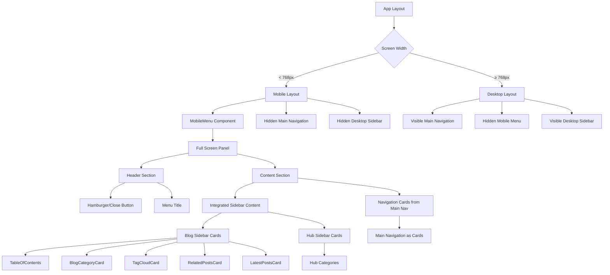

# 移动菜单优化设计文档

## 概述

本设计文档详细描述了 web、blog、hub 三个子应用移动菜单优化的技术实现方案。主要目标是创建统一的全屏移动菜单体验，实现卡片化导航布局，并为 blog 和 hub 子应用集成侧边栏内容的移动端展示。

## 架构

### 整体架构设计



### 响应式组件架构

1. **< 768px (移动端)**
   - 显示：MobileMenu + 集成的侧边栏内容 + 主导航卡片
   - 隐藏：主导航栏 + 桌面侧边栏

2. **≥ 768px (桌面端)**
   - 显示：主导航栏 + 桌面侧边栏
   - 隐藏：MobileMenu 组件

### 组件层次结构

1. **MobileMenu (主组件)**
   - 管理菜单开关状态
   - 处理全屏面板显示逻辑
   - 统一的事件处理和可访问性支持

2. **MobileMenuPanel (面板组件)**
   - 全屏覆盖层
   - 内容区域滚动管理
   - 响应式布局容器

3. **MobileMenuHeader (头部组件)**
   - 汉堡菜单/关闭按钮
   - 菜单标题
   - 按钮位置一致性保证

4. **MobileMenuContent (内容组件)**
   - 侧边栏内容区域 (仅 blog/hub)
   - 导航卡片区域
   - 网格布局管理

## 主导航到移动菜单的转换策略

### 转换原则

1. **内容一致性**
   - 移动菜单中的导航卡片必须与桌面主导航内容完全一致
   - 保持相同的链接、标题、图标和层级结构
   - 确保用户在不同设备上获得一致的导航体验

2. **布局转换**
   - 桌面主导航：水平布局，通常为导航栏形式
   - 移动菜单：卡片网格布局，12列网格中每行2张卡片

3. **交互转换**
   - 桌面主导航：悬停效果、下拉菜单
   - 移动菜单：触摸友好的卡片点击，全屏面板展示

### 转换实现

```typescript
// 主导航数据转换为移动菜单卡片
interface NavigationTransformer {
  transformMainNavToCards(mainNavItems: MainNavItem[]): NavCard[];
  preserveHierarchy(items: MainNavItem[]): NavCard[];
  adaptInteractions(desktopNav: DesktopNavConfig): MobileNavConfig;
}

// 主导航项结构
interface MainNavItem {
  id: string;
  label: string;
  href?: string;
  icon?: LucideIcon;
  children?: MainNavItem[];
  external?: boolean;
}

// 移动菜单卡片结构
interface NavCard {
  id: string;
  title: string;
  description?: string;
  href?: string;
  icon?: LucideIcon;
  external?: boolean;
  gridSpan: number; // 网格占用列数
}
```

## 组件和接口

### 核心接口定义

```typescript
// 移动菜单主组件接口
interface MobileMenuProps {
  className?: string;
  appType: 'web' | 'blog' | 'hub';
  sidebarContent?: React.ReactNode;
  mainNavigationItems: NavItem[]; // 来自主导航的菜单项
}

// 移动菜单面板接口
interface MobileMenuPanelProps {
  isOpen: boolean;
  onClose: () => void;
  children: React.ReactNode;
}

// 移动菜单头部接口
interface MobileMenuHeaderProps {
  isOpen: boolean;
  onToggle: () => void;
  title?: string;
}

// 移动菜单内容接口
interface MobileMenuContentProps {
  appType: 'web' | 'blog' | 'hub';
  sidebarContent?: React.ReactNode;
  navigationItems: NavItem[]; // 主导航转换的卡片
  onItemClick: () => void;
}

// 导航卡片接口
interface NavigationCardProps {
  item: NavItem;
  onClick: () => void;
  variant: 'navigation' | 'sidebar'; // 区分导航卡片和侧边栏卡片
}

// 侧边栏内容包装器接口
interface SidebarContentWrapperProps {
  appType: 'blog' | 'hub';
  children: React.ReactNode;
}

// 响应式布局控制接口
interface ResponsiveLayoutProps {
  breakpoint: 'mobile' | 'desktop';
  showMobileMenu: boolean;
  showMainNavigation: boolean;
  showDesktopSidebar: boolean;
}
```

### 组件实现细节

#### 1. MobileMenu 主组件

**职责：**
- 管理菜单开关状态
- 提供统一的移动菜单入口
- 处理不同应用类型的差异化逻辑
- 确保仅在 md 断点以下显示

**关键特性：**
- 使用 `useState` 管理 `isOpen` 状态
- 通过 `appType` 属性区分应用类型
- 支持可选的 `sidebarContent` 属性
- 实现键盘导航和可访问性支持
- **响应式控制**：仅在屏幕宽度 < 768px 时渲染和显示
- **主导航集成**：将桌面主导航内容转换为移动菜单卡片

#### 2. MobileMenuPanel 面板组件

**职责：**
- 提供全屏覆盖层
- 管理面板的显示和隐藏动画
- 处理点击外部区域关闭逻辑

**关键特性：**
- 使用 `fixed inset-0` 实现全屏覆盖
- 背景模糊效果 `backdrop-blur-sm`
- 支持滑动动画和过渡效果
- 正确的 z-index 层级管理

#### 3. MobileMenuHeader 头部组件

**职责：**
- 显示汉堡菜单/关闭按钮
- 确保按钮位置的一致性
- 提供菜单标题显示

**关键特性：**
- 按钮位置使用绝对定位确保一致性
- 图标切换动画效果
- ARIA 标签和可访问性支持
- 响应式设计适配

#### 4. MobileMenuContent 内容组件

**职责：**
- 管理内容区域的布局
- 处理侧边栏内容和导航卡片的排列
- 实现响应式网格布局

**关键特性：**
- 使用 CSS Grid 实现 12 列布局
- 条件渲染侧边栏内容
- 导航卡片的 2 列布局
- 垂直滚动支持

## 数据模型

### 导航项数据结构

```typescript
interface NavItem {
  key: string;
  label: string;
  href?: string;
  external?: boolean;
  icon?: LucideIcon;
  description?: string;
}
```

### 侧边栏内容数据结构

```typescript
// Blog 侧边栏数据
interface BlogSidebarData {
  tableOfContents?: TocHeading[];
  categories?: CategoryWithCount[];
  tags?: TagWithCount[];
  relatedPosts?: RelatedPost[];
  latestPosts?: LatestPost[];
}

// Hub 侧边栏数据
interface HubSidebarData {
  categories?: HubCategory[];
  selectedCategory?: string;
}
```

### 应用配置数据结构

```typescript
interface AppConfig {
  type: 'web' | 'blog' | 'hub';
  navItems: NavItem[];
  sidebarEnabled: boolean;
  sidebarData?: BlogSidebarData | HubSidebarData;
}
```

## 错误处理

### 错误场景和处理策略

1. **侧边栏数据加载失败**
   - 显示占位符内容
   - 提供重试机制
   - 记录错误日志

2. **导航配置缺失**
   - 使用默认导航配置
   - 显示错误提示
   - 降级到基础菜单

3. **组件渲染错误**
   - 使用 Error Boundary 捕获
   - 显示友好的错误信息
   - 提供刷新页面选项

4. **网络连接问题**
   - 缓存上次成功的数据
   - 显示离线状态提示
   - 自动重连机制

### 错误边界实现

```typescript
class MobileMenuErrorBoundary extends React.Component {
  constructor(props) {
    super(props);
    this.state = { hasError: false };
  }

  static getDerivedStateFromError(error) {
    return { hasError: true };
  }

  componentDidCatch(error, errorInfo) {
    console.error('MobileMenu Error:', error, errorInfo);
  }

  render() {
    if (this.state.hasError) {
      return <MobileMenuFallback />;
    }
    return this.props.children;
  }
}
```

## 测试策略

### 单元测试

1. **组件渲染测试**
   - 验证组件正确渲染
   - 测试不同 props 的渲染结果
   - 检查条件渲染逻辑

2. **状态管理测试**
   - 测试菜单开关状态
   - 验证状态更新逻辑
   - 检查副作用处理

3. **事件处理测试**
   - 测试点击事件处理
   - 验证键盘导航
   - 检查外部点击关闭

### 集成测试

1. **跨组件交互测试**
   - 测试父子组件通信
   - 验证数据流传递
   - 检查组件协作

2. **应用类型差异测试**
   - 测试不同应用的菜单内容
   - 验证侧边栏内容显示
   - 检查导航配置差异

### 端到端测试

1. **用户交互流程测试**
   - 测试完整的菜单操作流程
   - 验证导航跳转功能
   - 检查响应式行为

2. **可访问性测试**
   - 测试键盘导航
   - 验证屏幕阅读器支持
   - 检查 ARIA 属性

### 性能测试

1. **渲染性能测试**
   - 测试首次渲染时间
   - 验证重渲染优化
   - 检查内存使用

2. **动画性能测试**
   - 测试动画流畅度
   - 验证 60fps 性能
   - 检查低端设备表现

## 样式和布局设计

### CSS Grid 布局实现

```css
/* 移动菜单基础样式 - 仅在 md 断点以下显示 */
.mobile-menu {
  display: block;
}

/* 12 列网格布局 */
.mobile-menu-grid {
  display: grid;
  grid-template-columns: repeat(12, 1fr);
  gap: 1rem;
  padding: 1rem;
}

/* 侧边栏内容：每行 1 张卡片 */
.sidebar-card {
  grid-column: span 12;
}

/* 导航卡片：每行 2 张卡片 */
.navigation-card {
  grid-column: span 6;
}

/* 主导航 - 仅在 md 断点以上显示 */
.main-navigation {
  display: none;
}

/* 桌面侧边栏 - 仅在 md 断点以上显示 */
.desktop-sidebar {
  display: none;
}

/* md 断点及以上 (≥ 768px) */
@media (min-width: 768px) {
  .mobile-menu {
    display: none !important; /* 强制隐藏移动菜单 */
  }
  
  .main-navigation {
    display: flex; /* 显示主导航 */
  }
  
  .desktop-sidebar {
    display: block; /* 显示桌面侧边栏 */
  }
}

/* 小屏幕优化 (< 640px) */
@media (max-width: 640px) {
  .mobile-menu-grid {
    gap: 0.75rem;
    padding: 0.75rem;
  }
}
```

### 动画和过渡效果

```css
/* 面板进入动画 */
.mobile-menu-panel-enter {
  opacity: 0;
  transform: translateX(100%);
}

.mobile-menu-panel-enter-active {
  opacity: 1;
  transform: translateX(0);
  transition: opacity 300ms ease-out, transform 300ms ease-out;
}

/* 面板退出动画 */
.mobile-menu-panel-exit {
  opacity: 1;
  transform: translateX(0);
}

.mobile-menu-panel-exit-active {
  opacity: 0;
  transform: translateX(100%);
  transition: opacity 300ms ease-in, transform 300ms ease-in;
}

/* 按钮图标切换动画 */
.menu-icon-transition {
  transition: transform 200ms ease-in-out;
}
```

### 主题和样式变量

```css
:root {
  --mobile-menu-z-index: 50;
  --mobile-menu-backdrop: rgba(0, 0, 0, 0.5);
  --mobile-menu-panel-bg: var(--background);
  --mobile-menu-border-radius: 0.5rem;
  --mobile-menu-shadow: 0 10px 15px -3px rgba(0, 0, 0, 0.1);
  --mobile-menu-transition-duration: 300ms;
}
```

## 性能优化策略

### 组件优化

1. **React.memo 使用**
   - 对纯展示组件使用 memo
   - 自定义比较函数优化
   - 避免不必要的重渲染

2. **useMemo 和 useCallback**
   - 缓存计算结果
   - 稳定化事件处理函数
   - 优化依赖数组

3. **懒加载实现**
   - 侧边栏组件按需加载
   - 图标组件动态导入
   - 减少初始包大小

### 渲染优化

1. **虚拟化长列表**
   - 对大量导航项使用虚拟滚动
   - 减少 DOM 节点数量
   - 提升滚动性能

2. **批量状态更新**
   - 使用 unstable_batchedUpdates
   - 减少渲染次数
   - 提升交互响应性

### 资源优化

1. **图片和图标优化**
   - 使用 SVG 图标
   - 实现图标缓存
   - 减少网络请求

2. **CSS 优化**
   - 使用 CSS-in-JS 按需加载
   - 避免样式重复
   - 优化关键渲染路径

## 可访问性设计

### ARIA 支持

1. **语义化标记**
   - 正确的 role 属性
   - 描述性的 aria-label
   - 状态指示 aria-expanded

2. **键盘导航**
   - Tab 键顺序管理
   - Enter/Space 键激活
   - Escape 键关闭菜单

3. **屏幕阅读器支持**
   - 结构化的标题层级
   - 描述性的链接文本
   - 状态变化通知

### 焦点管理

1. **焦点陷阱**
   - 菜单打开时限制焦点范围
   - 循环焦点导航
   - 菜单关闭时恢复焦点

2. **视觉焦点指示**
   - 清晰的焦点样式
   - 高对比度支持
   - 自定义焦点环

## 响应式设计

### 断点策略

移动菜单和侧边栏的显示遵循严格的响应式断点规则：

- **< 768px (md 断点以下)**：显示移动菜单和侧边栏，隐藏主导航
- **≥ 768px (md 断点及以上)**：隐藏移动菜单和侧边栏，显示主导航

```css
/* 移动设备样式 (< 768px) */
.mobile-menu {
  display: block;
}

.main-navigation {
  display: none;
}

.sidebar {
  display: none; /* 桌面侧边栏在移动端隐藏 */
}

/* 桌面设备样式 (≥ 768px) */
@media (min-width: 768px) {
  .mobile-menu {
    display: none; /* 移动菜单在桌面端完全隐藏 */
  }
  
  .main-navigation {
    display: flex; /* 主导航在桌面端显示 */
  }
  
  .sidebar {
    display: block; /* 桌面侧边栏在桌面端显示 */
  }
}
```

### 响应式行为规范

1. **移动菜单显示条件**
   - 仅在屏幕宽度 < 768px 时显示
   - 包含汉堡菜单按钮和全屏面板
   - 集成侧边栏内容（blog 和 hub 应用）

2. **主导航显示条件**
   - 仅在屏幕宽度 ≥ 768px 时显示
   - 在移动端完全隐藏，内容转移到移动菜单卡片中

3. **侧边栏显示条件**
   - 桌面端（≥ 768px）：显示为独立侧边栏
   - 移动端（< 768px）：隐藏独立侧边栏，内容集成到移动菜单中

### 触摸优化

1. **触摸目标大小**
   - 最小 44px 触摸区域
   - 适当的间距设计
   - 防误触机制

2. **手势支持**
   - 滑动关闭菜单
   - 长按显示提示
   - 双击快速操作

## 实施指南

### 响应式断点实现步骤

1. **设置 CSS 媒体查询**
   ```css
   /* 移动端样式 (默认, < 768px) */
   .mobile-menu { display: block; }
   .main-navigation { display: none; }
   .desktop-sidebar { display: none; }
   
   /* 桌面端样式 (≥ 768px) */
   @media (min-width: 768px) {
     .mobile-menu { display: none; }
     .main-navigation { display: flex; }
     .desktop-sidebar { display: block; }
   }
   ```

2. **JavaScript 断点检测**
   ```typescript
   const useBreakpoint = () => {
     const [isMobile, setIsMobile] = useState(false);
     
     useEffect(() => {
       const checkBreakpoint = () => {
         setIsMobile(window.innerWidth < 768);
       };
       
       checkBreakpoint();
       window.addEventListener('resize', checkBreakpoint);
       return () => window.removeEventListener('resize', checkBreakpoint);
     }, []);
     
     return isMobile;
   };
   ```

3. **组件条件渲染**
   ```typescript
   const Layout = ({ mainNavItems, sidebarContent }) => {
     const isMobile = useBreakpoint();
     
     return (
       <>
         {isMobile ? (
           <MobileMenu 
             mainNavigationItems={mainNavItems}
             sidebarContent={sidebarContent}
           />
         ) : (
           <>
             <MainNavigation items={mainNavItems} />
             <DesktopSidebar content={sidebarContent} />
           </>
         )}
       </>
     );
   };
   ```

### 各应用实现要点

1. **Web 应用**
   - 移动菜单仅包含主导航卡片
   - 无侧边栏内容集成
   - 简洁的卡片布局

2. **Blog 应用**
   - 移动菜单包含侧边栏内容 + 主导航卡片
   - 侧边栏内容在上方，每行1张卡片
   - 主导航卡片在下方，每行2张卡片

3. **Hub 应用**
   - 移动菜单包含 Hub 分类 + 主导航卡片
   - Hub 分类内容在上方，每行1张卡片
   - 主导航卡片在下方，每行2张卡片

## 国际化支持

### 文本国际化

1. **多语言支持**
   - 使用 i18n 库
   - 动态语言切换
   - RTL 布局支持

2. **文本长度适配**
   - 弹性布局设计
   - 文本截断处理
   - 多行文本支持

### 文化适配

1. **颜色和图标**
   - 文化敏感色彩
   - 本地化图标
   - 符号含义适配

2. **交互习惯**
   - 本地化手势
   - 导航模式适配
   - 用户习惯考虑