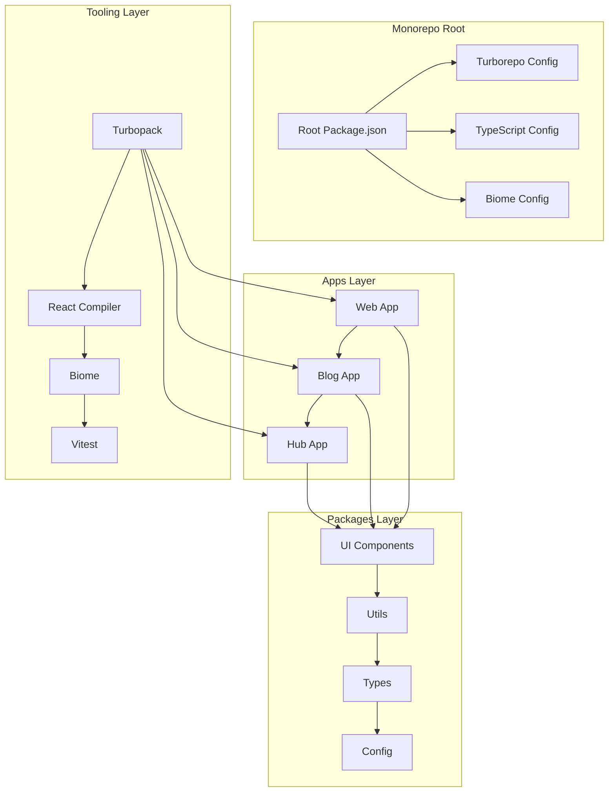

# 项目优化方案设计文档

## 概述

本设计文档基于现有的 Next.js 15 + React 19 + TypeScript 5.9 + Tailwind CSS 4.1 + Turborepo monorepo 项目，提供一个全面的优化方案。该方案旨在充分利用最新技术栈特性，精简代码结构，保持子应用独立性，并提升整体开发体验和性能。

## 架构

### 整体架构优化



### 技术栈升级策略

1. **React 19 特性利用**
   - React Compiler 自动优化
   - Actions 和 use() hook
   - 并发特性优化

2. **Next.js 15 特性利用**
   - Turbopack 构建优化
   - PPR (Partial Prerendering)
   - 新缓存策略

3. **TypeScript 5.9 特性利用**
   - 改进的类型推断
   - 新语法特性

4. **Tailwind CSS 4.1 特性利用**
   - 新 CSS 引擎
   - 性能优化

## 组件和接口

### 1. 构建系统优化

#### Turborepo 配置优化
```json
{
  "pipeline": {
    "build": {
      "dependsOn": ["^build"],
      "outputs": [".next/**", "dist/**"],
      "env": ["NODE_ENV", "NEXT_PUBLIC_*"],
      "cache": true
    },
    "dev": {
      "cache": false,
      "persistent": true,
      "dependsOn": ["^build"]
    }
  },
  "remoteCache": {
    "signature": true
  }
}
```

#### Next.js 配置优化
```javascript
const nextConfig = {
  // React Compiler 启用
  experimental: {
    reactCompiler: true,
    ppr: true, // Partial Prerendering
    dynamicIO: true
  },
  
  // Turbopack 优化
  turbopack: {
    rules: {
      "*.svg": ["@svgr/webpack"],
      "*.md": ["raw-loader"]
    }
  },
  
  // 性能优化
  compress: true,
  poweredByHeader: false,
  
  // 代码分割优化
  webpack: (config, { dev, isServer }) => {
    if (!dev && !isServer) {
      config.optimization.splitChunks = {
        chunks: 'all',
        cacheGroups: {
          vendor: {
            test: /[\\/]node_modules[\\/]/,
            name: 'vendors',
            chunks: 'all',
          }
        }
      }
    }
    return config
  }
}
```

### 2. 代码质量工具链

#### Biome 配置优化
```json
{
  "linter": {
    "enabled": true,
    "rules": {
      "recommended": true,
      "correctness": {
        "useExhaustiveDependencies": "error"
      },
      "performance": {
        "noAccumulatingSpread": "error"
      }
    }
  },
  "formatter": {
    "enabled": true,
    "indentStyle": "space",
    "indentWidth": 2,
    "lineWidth": 100
  }
}
```

### 3. 包管理优化

#### 依赖管理策略
- 使用 pnpm workspace 进行依赖管理
- 统一版本管理策略
- 自动依赖更新机制

#### 共享包结构
```
packages/
├── ui/                 # UI 组件库
│   ├── src/
│   │   ├── components/
│   │   ├── hooks/
│   │   └── index.ts
│   └── package.json
├── utils/              # 工具函数
├── types/              # 共享类型定义
└── config/             # 共享配置
```

## 数据模型

### 配置管理模型

```typescript
// 统一配置接口
interface AppConfig {
  name: string
  version: string
  environment: 'development' | 'production' | 'test'
  features: FeatureFlags
  api: ApiConfig
}

interface FeatureFlags {
  reactCompiler: boolean
  ppr: boolean
  turbopack: boolean
}

interface ApiConfig {
  baseUrl: string
  timeout: number
  retries: number
}
```

### 性能监控模型

```typescript
interface PerformanceMetrics {
  buildTime: number
  bundleSize: number
  loadTime: number
  renderTime: number
}

interface OptimizationTarget {
  metric: keyof PerformanceMetrics
  threshold: number
  action: string
}
```

## 错误处理

### 1. 构建错误处理
- TypeScript 严格模式错误处理
- Turbopack 构建错误恢复
- 依赖冲突解决策略

### 2. 运行时错误处理
- React Error Boundary 优化
- Next.js 错误页面定制
- 性能监控和报警

### 3. 开发时错误处理
- 热重载错误恢复
- 类型检查错误提示
- Linting 错误自动修复

## 测试策略

### 1. 单元测试
- Vitest 配置优化
- React Testing Library 集成
- 覆盖率目标设定

### 2. 集成测试
- 组件集成测试
- API 集成测试
- 跨应用集成测试

### 3. E2E 测试
- Playwright 配置优化
- 关键用户流程测试
- 性能测试集成

### 4. 测试配置优化

```typescript
// vitest.config.ts
export default defineConfig({
  test: {
    environment: 'jsdom',
    setupFiles: ['./src/test/setup.ts'],
    coverage: {
      provider: 'v8',
      reporter: ['text', 'json', 'html'],
      threshold: {
        global: {
          branches: 80,
          functions: 80,
          lines: 80,
          statements: 80
        }
      }
    }
  }
})
```

## 性能优化策略

### 1. 构建性能优化
- Turbopack 启用
- 增量构建优化
- 缓存策略优化

### 2. 运行时性能优化
- React Compiler 自动优化
- 代码分割策略
- 懒加载实现

### 3. 网络性能优化
- 静态资源优化
- CDN 配置
- 缓存策略

### 4. 监控和分析
- Web Vitals 监控
- Bundle 分析
- 性能回归检测

## 开发体验优化

### 1. 开发工具配置
```json
{
  "scripts": {
    "dev": "turbo run dev --parallel",
    "dev:fast": "turbo run dev --parallel --no-deps --filter=!@repo/e2e",
    "build": "turbo run build",
    "test": "turbo run test",
    "lint": "turbo run lint",
    "type-check": "turbo run type-check"
  }
}
```

### 2. IDE 配置优化
- VSCode 设置优化
- TypeScript 配置优化
- 调试配置

### 3. Git Hooks 集成
```json
{
  "husky": {
    "hooks": {
      "pre-commit": "lint-staged",
      "pre-push": "turbo run type-check test"
    }
  },
  "lint-staged": {
    "*.{ts,tsx,js,jsx}": ["biome check --apply"]
  }
}
```

## 部署和 CI/CD 优化

### 1. 构建优化
- Docker 多阶段构建
- 构建缓存优化
- 并行构建策略

### 2. 部署策略
- 独立应用部署
- 共享资源管理
- 环境配置管理

### 3. CI/CD 流水线
```yaml
# .github/workflows/ci.yml
name: CI
on: [push, pull_request]
jobs:
  test:
    runs-on: ubuntu-latest
    steps:
      - uses: actions/checkout@v4
      - uses: pnpm/action-setup@v2
      - run: pnpm install --frozen-lockfile
      - run: turbo run lint type-check test build
```

## 迁移策略

### 1. 渐进式迁移
- 分阶段实施计划
- 向后兼容性保证
- 风险评估和缓解

### 2. 数据迁移
- 配置文件迁移
- 依赖版本升级
- 代码重构策略

### 3. 团队培训
- 新特性培训
- 最佳实践分享
- 文档更新

## 监控和维护

### 1. 性能监控
- 构建时间监控
- 运行时性能监控
- 用户体验指标

### 2. 依赖管理
- 自动依赖更新
- 安全漏洞扫描
- 许可证合规检查

### 3. 代码质量监控
- 代码覆盖率监控
- 技术债务跟踪
- 代码复杂度分析