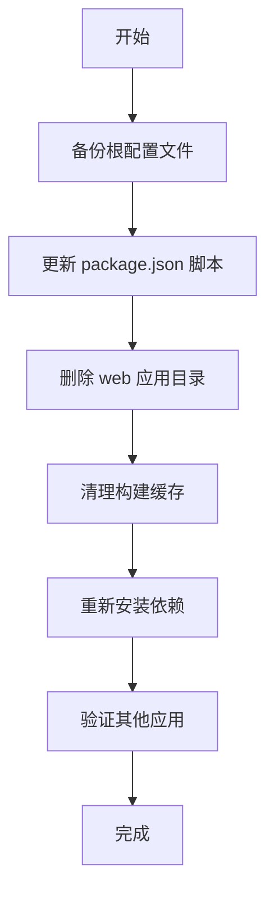

# Design Document

## Overview

本设计文档描述了如何安全地从 monorepo 项目中移除 web 子应用。该操作涉及删除应用目录、清理配置文件中的引用、清除构建缓存，并验证其他应用不受影响。

## Architecture

移除操作采用分阶段方法，确保每个步骤都是可逆的，并在关键点进行验证：

## Components and Interfaces

### 1. 配置文件更新组件

**职责**: 从根 package.json 中移除 web 应用相关的脚本

**需要修改的脚本**:
- `dev:web`: 移除
- `build:web`: 移除
- `start:web`: 移除
- `test:e2e:web`: 移除

**保留的脚本**:
- 通用脚本（dev, build, test 等）
- blog 相关脚本
- hub 相关脚本
- 工具脚本（deps:*, workspace:* 等）

### 2. 目录删除组件

**职责**: 安全删除 apps/web 目录

**删除范围**:
- `apps/web/` 整个目录
- 包括所有源代码、配置文件、依赖和构建产物

**验证点**:
- 确认 apps/blog 和 apps/hub 目录完整
- 确认 packages/* 目录不受影响

### 3. 缓存清理组件

**职责**: 清理 Turborepo 缓存中的 web 应用数据

**清理目标**:
- `.turbo/cache/` 中与 @repo/web 相关的缓存文件
- 可选：完全清空 .turbo 目录以确保干净状态

**方法**: 
- 使用 `turbo run clean` 或直接删除 .turbo 目录

### 4. 验证组件

**职责**: 确保移除操作后项目仍然可用

**验证步骤**:
1. 执行 `pnpm install` 重新安装依赖
2. 尝试运行 `pnpm dev:blog` 验证 blog 应用
3. 尝试运行 `pnpm dev:hub` 验证 hub 应用
4. 检查是否有错误或警告

## Data Models

不涉及数据模型，主要是文件系统操作和配置更新。

## Error Handling

### 潜在错误场景

1. **文件删除失败**
   - 原因：文件被占用或权限不足
   - 处理：提示用户关闭相关进程或以管理员权限运行

2. **配置文件格式错误**
   - 原因：JSON 格式损坏
   - 处理：在修改前验证 JSON 格式，修改后再次验证

3. **依赖安装失败**
   - 原因：网络问题或 pnpm 缓存问题
   - 处理：清理 pnpm 缓存后重试

4. **其他应用启动失败**
   - 原因：可能存在对 web 应用的隐式依赖
   - 处理：检查 blog 和 hub 的 package.json，确认没有引用 @repo/web

## Testing Strategy

### 手动测试步骤

1. **前置检查**
   - 确认当前项目状态正常
   - 记录当前的 package.json 内容

2. **执行移除操作**
   - 按照实现计划逐步执行

3. **功能验证**
   - 验证 blog 应用可以正常开发和构建
   - 验证 hub 应用可以正常开发和构建
   - 验证通用命令（如 `pnpm build:apps`）不会报错

4. **清理验证**
   - 确认 apps/web 目录不存在
   - 确认 package.json 中没有 web 相关脚本
   - 确认没有遗留的构建产物

### 回滚策略

如果移除操作导致问题：
1. 使用 Git 恢复 package.json
2. 从备份或 Git 历史恢复 apps/web 目录
3. 重新运行 `pnpm install`

## Implementation Notes

- 使用 Windows 兼容的命令（考虑到系统环境是 Windows）
- 在删除目录前确认路径正确，避免误删
- 保持操作的原子性，每个步骤完成后进行验证
- 建议在执行前创建 Git commit，便于回滚
